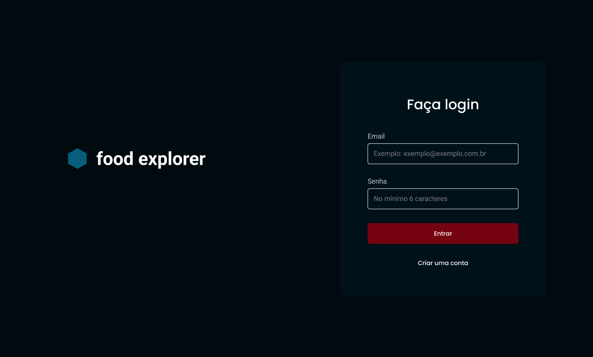
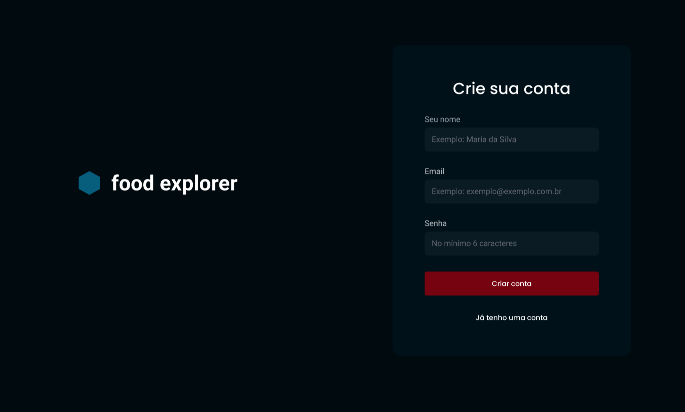
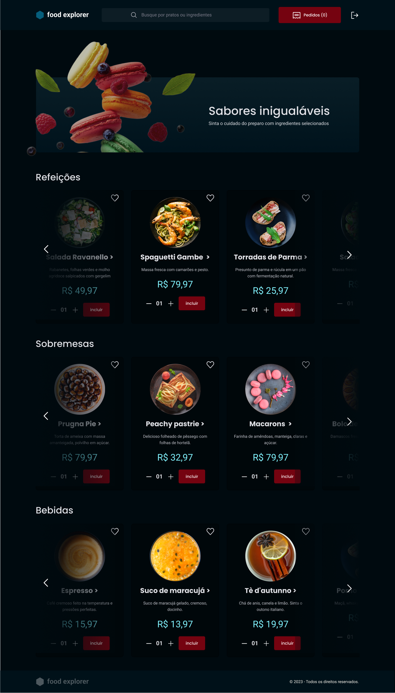
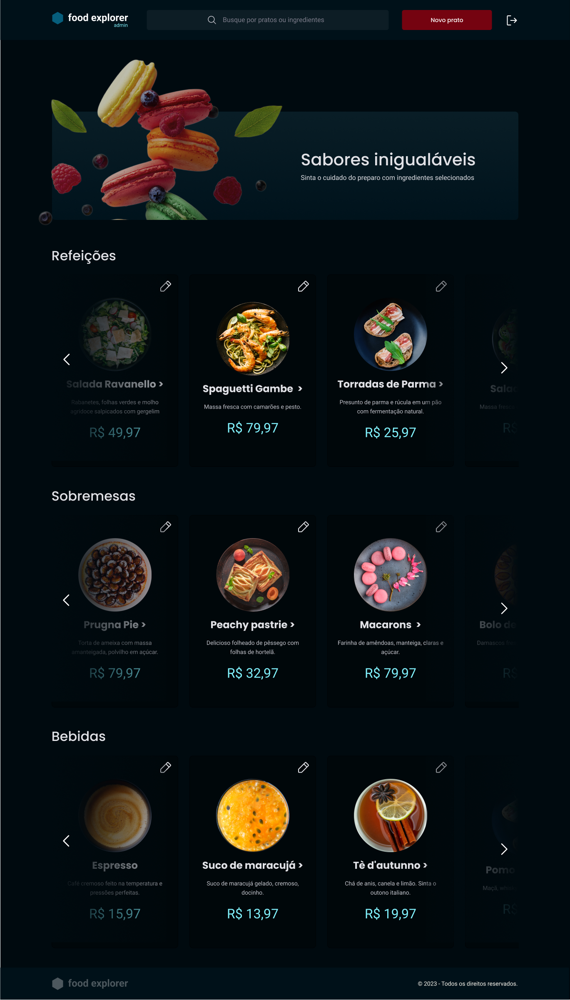
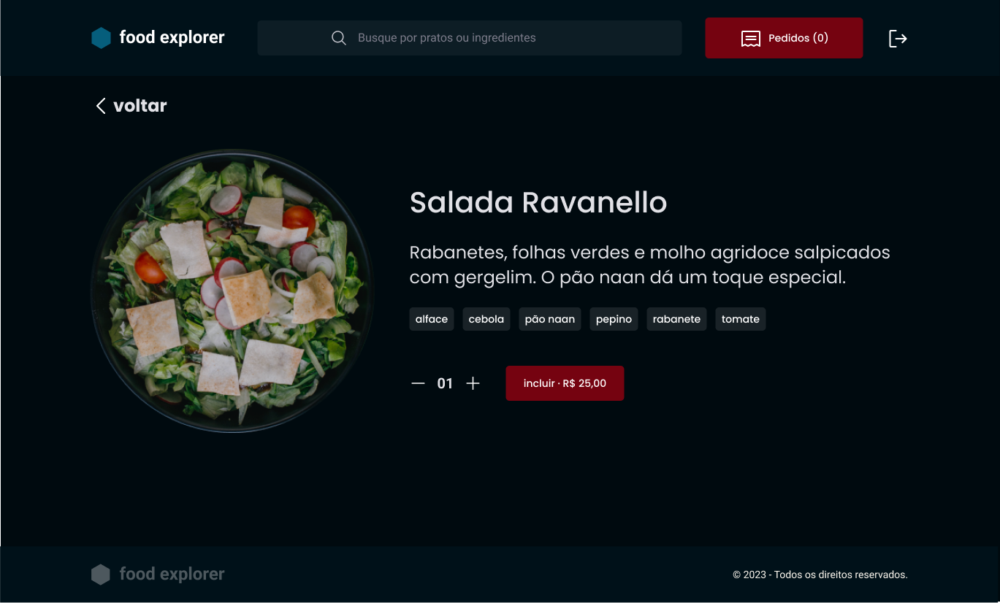
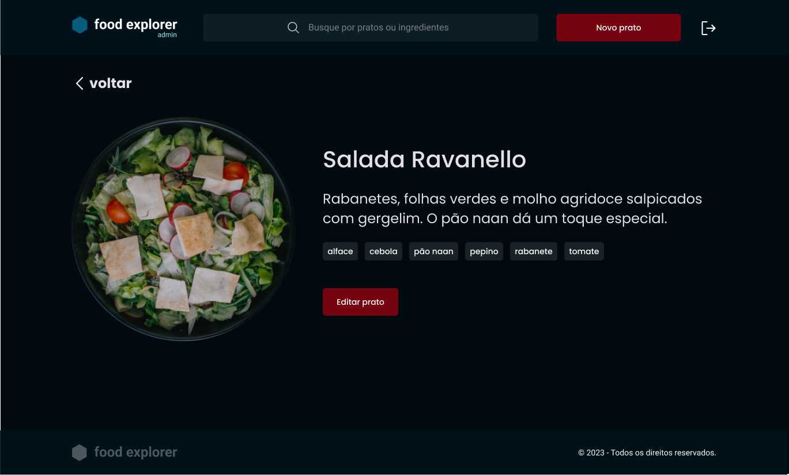

<a name="readme-top"></a>

<div align="center">
  

  <br>
  <br>

  <p>
    <a href="#-projeto">Projeto</a>&nbsp;&nbsp;&nbsp;|&nbsp;&nbsp;&nbsp;
    <a href="#-paginas">Páginas</a>&nbsp;&nbsp;&nbsp;|&nbsp;&nbsp;&nbsp;
    <a href="#-funcionalidades">Funcionalidades</a>&nbsp;&nbsp;&nbsp;|&nbsp;&nbsp;&nbsp;
    <a href="#-tecnologisa">Tecnologias</a>&nbsp;&nbsp;&nbsp;|&nbsp;&nbsp;&nbsp;
    <a href="#-personas">Personas</a>&nbsp;&nbsp;&nbsp;|&nbsp;&nbsp;&nbsp;
    <a href="#-utilização">Utilização</a>
  </p>
  
  <a href="#-license">
    
  </a>
</div>

## 1️⃣ Sobre o projeto

O projeto Food Explorer consiste no desafio final do programa Explorer da Rocketseat. Trata-se de uma aplicação de cardápio digital para um restaurante fictício, o resultado final está disponível em https://food-explorer-frontend2024.netlify.app/ O back-end do projeto, que lida com a lógica e o armazenamento dos dados, está no repositório https://github.com/joao-sillva/food-explorer-backend

## 2️⃣ Páginas
<p>lado esquerdo (user) - lado direito (admin)</p>
<table>
  <tr>
    <td></td>
    <td></td>
  </tr>
  <tr>
    <td>
    </td>
    <td></td>
  </tr> 
   <tr>
    <td></td>
    <td></td>
  </tr> 
</table>

## 2️⃣ Funcionalidades

- Login
- Cadastro
- Cadastrar pratos
- Mostrar pratos cadastrados
- Filtrar pratos
- Mostrar detalhes do prato
- Favoritar prato
- Remover prato dos favoritos
- Mostrar favoritos
- Adicionar prato ao carrinho
- Editar prato
- Excluir prato
- Logout

## 3️⃣ Tecnologias
- Axios
- ReactJS
- ReactDOM
- React Icons
- React Responsive
- React Router Dom
- Styled Components
- Swiper
- ViteJS

## 4️⃣ Personas
A aplicação possui duas personas principais: o admin e o usuário. Você pode criar um novo usuário ou testar a aplicação usando as seguintes informações de login:

Admin:
- Email: admin@email.com
- Senha: admin123

O admin tem acesso privilegiado e pode gerenciar o cardápio, adicionando, editando e removendo pratos, além de executar outras tarefas.

Usuário:
- Email: user@email.com
- Senha: user123

O usuário tem acesso restrito às funcionalidades da aplicação, podendo visualizar o cardápio, filtrar pratos, ver detalhes de pratos específicos, favoritar pratos e adicionar pratos ao carrinho.

## 5️⃣ Utilização

1. Clone o projeto:

```
$ git clone https://github.com/joao-sillva/food-explorer-frontend
```

2. Acesse a pasta do projeto:

```
$ cd food-explorer-frontend
```

3. Instale as dependências:

```
$ npm install
```

4. Execute a aplicação:

```
$ npm run dev
```

5. Acesse o endereço:

```
$ http://localhost:5173/
```

## ✨ Author
Feito por João Victor, se você tiver alguma dúvida ou quiser entrar em contato, você pode me enviar uma mensagem pelo
[LinkedIn](https://www.linkedin.com/in/joao-sillva/).

<p align="right">(<a href="#readme-top">voltar ao topo</a>)</p>